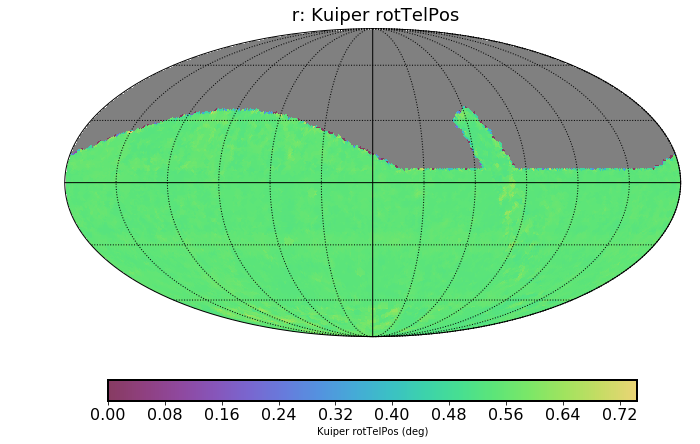

# Intro

Full MAF outputs available at:  http://astro-lsst-01.astro.washington.edu:8082/

For metrics we run on every survey, we like to keep the runtime reasonable. Currently, the glance bundle runs in 15 minutes, and the science radar in 60 minutes for 10-year simulations. The Solar System metrics require propagating orbits, so it's a 2-step process that takes a total of XXX.

# Basic Survey Properties

## Survey Depth

Compute the expected final coadded depth in each filter. 

## Number of Visits

Compute the total number of visits for each filter.

Also done in alt/az space (useful for checking that we are not observing at high airmass).

We have stats tables by fraction and total number for the different observing modes

## Filter distribution

Visualization of what filters are loaded. Useful to see if redder filters are begin used in bright time and twilight. Rapid filter changes are usually deep drilling sequences.

## Filter Changes

How often we change filters.

## Open Shutter Fraction

How much time is the camera shutter open compared to how much time is available. Drops when there is more slewing, more filter changing, or the shutter is closed for readout between snaps.

## Slew Stats

We have plots for slew distances and times. Note the slewtime distribution has a bump around 40 seconds. Those are slews with a large enough altitude change that there is a 40s optics loop run. The peak at 120s are filter changes (filter change time is included in slewtime). Finally the peak at 160s is a filer change combined with an optics loop. Note the log scale, the vast majority of slews are under 5 seconds.

## Pair Fraction

The fraction of observations taken as pairs (e.g., can be used to identify moving objects)

# SRD Metrics

## fO

How well do we meet the SRD requirement to observe 18,000 square degrees 825 times.

## Parallax and Proper Motion

Estimates of how precisely we can measure proper motion and parallax for an isolated point source.

# Science Metrics

## Supernovae

Given a population of Type Ia SNe, we randomly distribute them on the sky and check what fraction are detected at all, how many observation of SNe there are, what fraction are detected pre-peak, and what fraction are "well sampled"

## Galaxy Counts

The number of galaxies that can be detected (in i-band) accounting for dust extinction

## DDF SNe

As with the full sky SNe recovery, only now focused on each DDF

## DDF depth

We compute the median depth of each DDF in each filter

## Annual coverage

We check how many unique years a spot on the sky is observed per filter. Useful for determining if we will always have image subtraction templates.

## Parallax and Proper Motion

A variety of parallax and proper motion metrics computed for point sources at r=22.5 and r=24 mag. We also check for degeneracy with DCR.

## Rapid Revisit

An SRD requirement, checking how much of the sky receives at least 82 visits between 0.667 and 30.0 minutes, with at least 28 of those visits falling between 0.667 and 20.0 minutes

## Kilonova

Similar to the SNe metric, only now with a kilonova light curve.

## Camera Rotator Angle Distribution

We look at how uniform the camera angle distribution is in each filter.

## Solar System Stuff

lots of solar system metrics for various populations

# Metrics that would be nice to have

Some of these are in progress, or we suspect are in progress from the science collaborations.

## Photometric redshift

We currently don't have a measure of how well photometric redshift performs. This metric would let us to better measure varying the filter distribution.

## LMC/SMC

We don't have any metrics specific to the LMC/SMC. 

## More Deep Drilling Science

We have the coadded depths, and number of SNe recovered. It would be nice to have other science case tests for the DDFs. This is useful for optimizing the DDF dithering strategy and overall cadence of DDF observations.

## AGN

We don't have any metrics specifically looking at AGN science

## Weak Lensing

Would be nice to know the total number of galaxies available for weak lensing. Or perhaps the limit on systematic errors across the sky to measure the shape of a fiducial galaxy.

## Microlensing

## Bulge specific metrics

## Relevant populations of galactic transients

## Anything that is sensitive to the Galactic anti-center?

